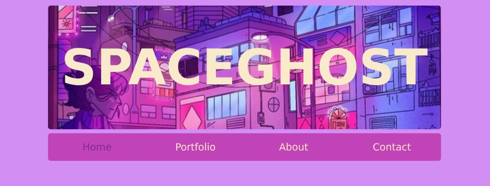

# Art Portfolio Website
Vapourwave inspired art portfolio website

## Introduction
This website is an art portfolio  for a fake example artist 'Spaceghost'. It serves as a base layout for a basic portfolio. 
It is a simple design with space for information and content, it is designd to show the aesthetic and worldbuilding of the artist it is representing, using its design features such as colour, text and layout
The colour palette is inspired by cyberpunk and vapourwave digital art. IT was built and designed using HTML and CSS. 

## Navigation
The header and navigation bar is always available at the top of the website

+ The langing page (home page)
+ The portfolio page
+ The about page (has the button link to resume page)
+ The contact page

## Improvements
This website is device compatible (it was designed with that in mind). There are hover features which make the website more interesting.

## Known issues
None that are known, improvements are always welcome though!

